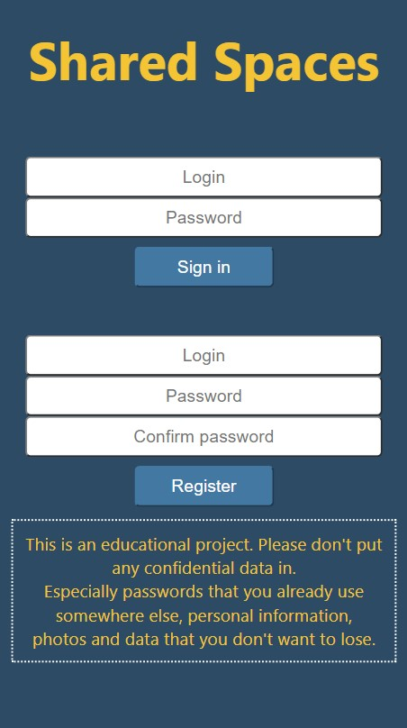
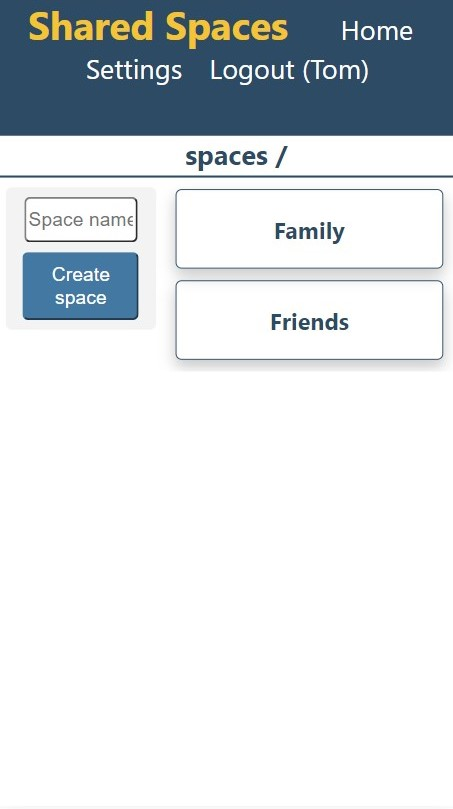
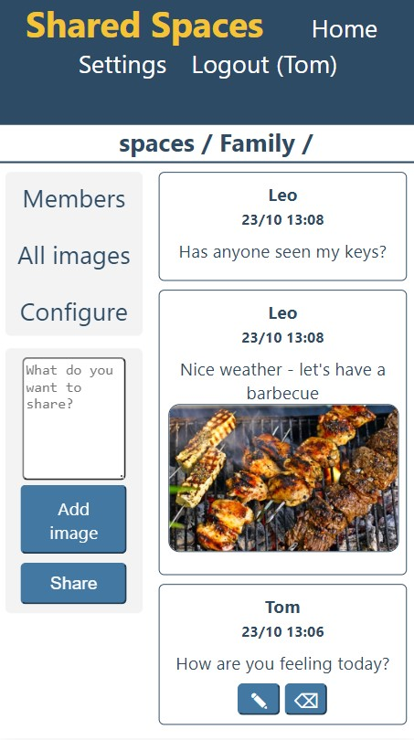

# Shared Spaces - frontend
Front-end for the Shared Spaces application created using React
 

## Table of Contents
* [General Info](#general-information)
* [Technologies Used](#technologies-used)
* [Screenshots](#screenshots)

## General Information
This project utilizes React to create a front-end for the REST API interface of the Shared Spaces application.
All functionalities provided by the back-end are utilized. The UI is responsive and mobile friendly. 
The app is hosted on an AWS EC2 Ubuntu instance by a Nginx server.  
Live demo: [Click here](http://ec2-54-146-229-245.compute-1.amazonaws.com/)

## Technologies Used
- React - version 18.2.0

## Screenshots

